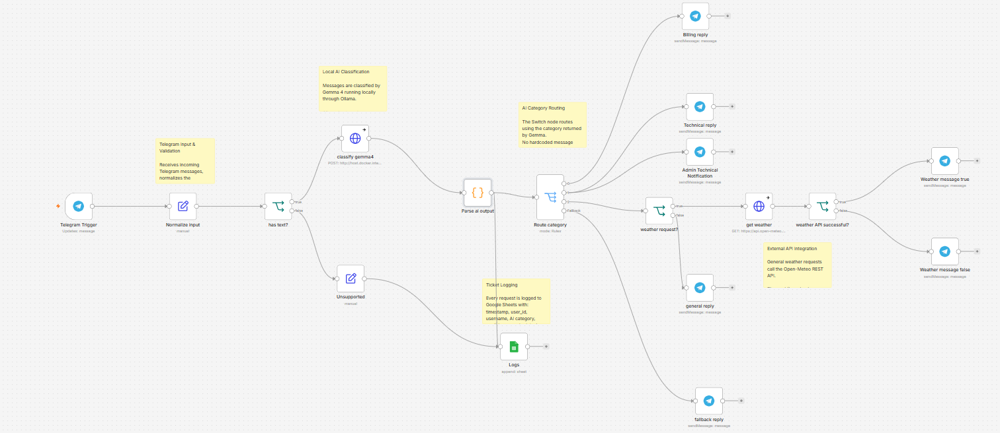
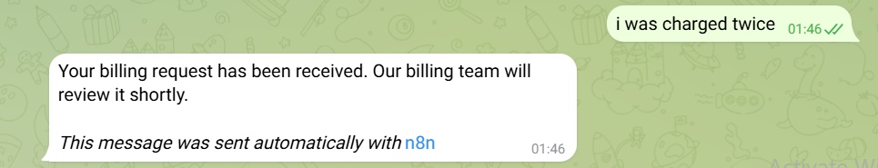
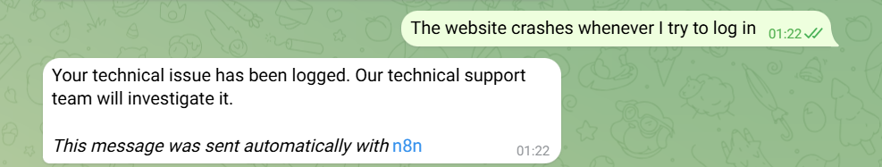
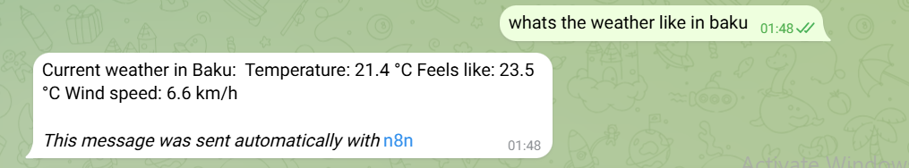
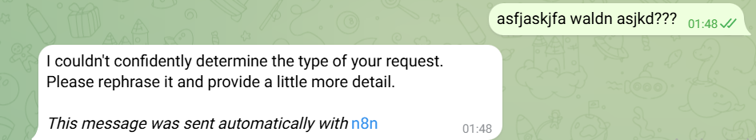

# Customer Support Ticket Bot with n8n, Telegram, and Local Gemma 4

An AI-powered customer support automation built with **n8n**, **Telegram**, **Ollama**, **Gemma 4**, **Google Sheets**, and the **Open-Meteo API**.

The workflow receives support requests through a Telegram bot, classifies each message locally using Gemma 4, routes the request into the appropriate support category, logs tickets to Google Sheets, automatically replies to users, and calls an external API when required.

The LLM runs locally through Ollama, so no external LLM API key is required.

---

## Features

- Telegram bot integration
- Local Gemma 4 classification through Ollama
- Structured JSON AI output
- AI-based routing rather than keyword matching
- Billing, Technical, and General support categories
- Default/fallback routing
- Confidence-based classification handling
- Google Sheets ticket logging
- Distinct automatic Telegram replies
- Open-Meteo external REST API integration
- Live weather information returned through Telegram
- Non-text/unsupported input handling
- Malformed AI response handling
- Ollama failure handling
- External API failure handling
- Technical-ticket administrator notification
- n8n sticky-note documentation

---

## Architecture

```text
Telegram Trigger
      ↓
Normalize Input
      ↓
Has Text?
   /        \
FALSE       TRUE
 ↓           ↓
Unsupported  Classify with Gemma 4
 ↓                  ↓
Unsupported     Parse & Validate
Reply            AI Output
                     ↓
              ┌──────┴──────→ Google Sheets
              ↓
          Route Category
       /       |        |        \
 Billing   Technical  General   Fallback
    ↓          ↓         ↓          ↓
 Billing    Technical  Weather?   Fallback
  Reply      Reply      /    \      Reply
              │       YES    NO
              │        ↓      ↓
              │    Open-Meteo General
              │        ↓      Reply
              │    API Success?
              │      /     \
              │    YES      NO
              │     ↓        ↓
              │  Weather   API Error
              │   Reply     Reply
              │
              └──→ Admin Technical Notification
```

---

## Technologies Used

- **n8n**
- **Docker**
- **Telegram Bot API**
- **Ollama**
- **Gemma 4 e2b**
- **Google Sheets**
- **Open-Meteo REST API**
- **Cloudflare Tunnel**

---

## Telegram Integration

Incoming support messages are received through an n8n **Telegram Trigger** node.

Because n8n is self-hosted locally, Telegram requires a public HTTPS webhook. A Cloudflare Tunnel is used to expose the local n8n webhook securely during development.

Example architecture:

```text
Telegram
   ↓
Public HTTPS Cloudflare URL
   ↓
Cloudflare Tunnel
   ↓
localhost:5678
   ↓
n8n
```

---

## Local AI Classification

Gemma 4 runs locally using Ollama.

The project uses:

```text
gemma4:e2b
```

The model can be pulled with:

```powershell
ollama pull gemma4:e2b
```

n8n runs inside Docker while Ollama runs on the Windows host.

Because `localhost` inside the n8n container refers to the container itself, n8n communicates with Ollama through:

```text
http://host.docker.internal:11434/api/chat
```

rather than:

```text
http://localhost:11434/api/chat
```

---

## Structured AI Output

Gemma is instructed to return structured JSON containing the support category, confidence score, and optional action.

Example:

```json
{
  "category": "technical",
  "confidence": 0.96,
  "action": "none"
}
```

Allowed categories are:

```text
billing
technical
general
```

Allowed actions are:

```text
none
weather
```

The system prompt constrains Gemma to these values instead of allowing arbitrary category names.

---

## Confidence and Validation

The AI response is parsed and validated before routing.

The workflow checks that:

- the category is allowed
- the confidence value is valid
- the action is allowed
- the response is valid JSON

A confidence threshold of:

```text
0.60
```

is used.

If the confidence is below the threshold, the final category becomes:

```text
unrecognized
```

Example:

```json
{
  "category": "general",
  "confidence": 0.25,
  "action": "none"
}
```

becomes:

```text
category = unrecognized
```

and is sent through the fallback path.

Malformed or invalid AI output is handled the same way instead of crashing the workflow.

---

## AI-Powered Routing

The n8n **Switch** node reads:

```text
category
```

from the parsed Gemma response.

It contains the following routes:

```text
billing
technical
general
fallback
```

The Switch does **not** classify messages using hardcoded keywords.

For example:

```text
"I was charged twice for my subscription"
        ↓
Gemma 4
        ↓
category = billing
        ↓
Switch
        ↓
Billing Reply
```

This ensures that routing is based on local AI classification.

---

## Billing Support

Example message:

```text
I was charged twice for my subscription
```

Gemma returns approximately:

```json
{
  "category": "billing",
  "confidence": 1,
  "action": "none"
}
```

The user receives:

```text
Your billing request has been received. Our billing team will review it shortly.
```

---

## Technical Support

Example message:

```text
The website crashes when I try to log in.
```

Gemma classifies the ticket as:

```text
technical
```

The customer receives a dedicated technical-support response.

Technical tickets also activate the **Admin Technical Notification** bonus path.

---

## Bonus: Technical Ticket Admin Notification

When a request is classified as technical, the workflow performs two actions:

```text
Technical branch
      ├──→ Technical Reply to customer
      │
      └──→ Admin Technical Notification
```

The administrator notification contains information such as:

```text
New technical support ticket

User: <username>
User ID: <user_id>

Message:
<original message>

AI confidence: <confidence>

Timestamp: <timestamp>
```

The administrator's Telegram Chat ID is configured locally and is not included as a secret in this repository.

---

## General Requests

Messages that are not billing or technical are classified as:

```text
general
```

A normal general request receives:

```text
Thanks for contacting support. Your general request has been received.
```

The General path also contains the external API integration.

---

## External API Integration

The project uses the **Open-Meteo REST API** as its required external API.

Gemma detects weather requests by returning:

```json
{
  "category": "general",
  "action": "weather"
}
```

Example user message:

```text
Tell me the weather
```

The workflow then follows:

```text
General
   ↓
Weather Request?
   ↓ TRUE
Get Weather
   ↓
Open-Meteo API
```

The API request uses:

```text
https://api.open-meteo.com/v1/forecast
```

with parameters for:

```text
latitude
longitude
current
timezone
```

The current weather response includes:

- Temperature
- Apparent temperature
- Wind speed

The live API result is then returned to the Telegram user.

---

## Google Sheets Logging

Tickets are persisted to Google Sheets.

Each logged row contains:

| Field | Description |
|---|---|
| `timestamp` | Time the Telegram message was received |
| `user_id` | Telegram user ID |
| `username` | Telegram username/name |
| `category` | AI-assigned category |
| `confidence` | Gemma classification confidence |
| `message` | Original support request |

Example:

```text
timestamp: 2026-09-11T16:31:50
user_id: 123456789
username: example_user
category: billing
confidence: 1
message: I was charged twice for my subscription
```

---

## Error Handling

The workflow is designed so failures do not leave the user without a response.

### Unsupported / Non-Text Input

The workflow first checks whether the normalized Telegram message contains text.

If the user sends an image, sticker, or other unsupported non-text content:

```text
Has Text?
   ↓ FALSE
Unsupported
```

The bot responds:

```text
I can currently process text messages only. Please send your request as text.
```

---

### Low-Confidence Classification

If Gemma returns a confidence below:

```text
0.60
```

the request becomes:

```text
unrecognized
```

and is routed to the fallback reply.

The user receives:

```text
I couldn't confidently determine the type of your request.
Please rephrase it and provide a little more detail.
```

---

### Malformed AI Output

The AI output parser uses validation and error handling.

If Gemma returns malformed or non-JSON output:

```text
category = unrecognized
confidence = 0
ai_ok = false
```

The request therefore reaches the fallback branch rather than crashing the workflow.

---

### Ollama Failure

The Ollama HTTP Request node is configured to continue on error.

If:

- Ollama is stopped
- the model fails to load
- the connection is refused
- the request times out

the workflow still continues.

The parsing node recognizes that no valid Gemma response exists and routes the user to the fallback reply.

This behavior was tested by intentionally making the Ollama endpoint unavailable.

---

### External API Failure

The weather API call also continues on error.

After the Open-Meteo request, the workflow verifies that:

```text
current.temperature_2m
```

exists.

If the API fails, the bot responds:

```text
Sorry, the weather service is currently unavailable. Please try again later.
```

instead of stopping the workflow.

---

## Test Cases

### Test 1 — Billing

Input:

```text
I was charged twice for my subscription
```

Expected:

```text
Gemma
→ category=billing
→ Billing branch
→ Billing Reply
→ Google Sheets log
```

---

### Test 2 — Technical

Input:

```text
The website crashes when I try to log in
```

Expected:

```text
Gemma
→ category=technical
→ Technical branch
→ Customer Technical Reply
→ Admin Technical Notification
→ Google Sheets log
```

---

### Test 3 — General

Input:

```text
Hello, what services do you offer?
```

Expected:

```text
Gemma
→ category=general
→ action=none
→ Weather Request? FALSE
→ General Reply
```

---

### Test 4 — Weather API

Input:

```text
Tell me the weather
```

Expected:

```text
Gemma
→ category=general
→ action=weather
→ Weather Request? TRUE
→ Open-Meteo
→ Weather API Successful? TRUE
→ Live Weather Reply
```

---

### Test 5 — Ambiguous Input

Input:

```text
fdsjkl fdjs ???
```

Expected:

```text
Low confidence
→ category=unrecognized
→ Fallback
→ Rephrase message
```

---

### Test 6 — Unsupported Input

Input:

```text
Telegram photo or sticker
```

Expected:

```text
Has Text? FALSE
→ Unsupported
→ Text-only warning
```

---

### Test 7 — Ollama Failure

The Ollama API endpoint is intentionally made unavailable.

Expected:

```text
Gemma HTTP Request fails
→ Workflow continues
→ category=unrecognized
→ Fallback Reply
```

---

### Test 8 — External API Failure

The Open-Meteo endpoint is intentionally made unavailable.

Expected:

```text
Weather API fails
→ Weather API Successful? FALSE
→ API Error Reply
```

---

## Running the Project Locally

### Prerequisites

Install:

- Docker Desktop
- Ollama
- Cloudflared
- Git
- A Telegram bot created through BotFather
- Google account for Google Sheets

---

## 1. Start Docker Desktop

Docker Desktop must be running before n8n can start.

---

## 2. Check Ollama

Open PowerShell:

```powershell
curl.exe http://localhost:11434/api/tags
```

If Ollama is already running, the command should return JSON containing the locally installed models.

If Ollama is not running:

```powershell
ollama serve
```

Keep that terminal open.

The model can be installed with:

```powershell
ollama pull gemma4:e2b
```

It is not necessary to manually run:

```powershell
ollama run gemma4:e2b
```

every time because Ollama can load the model when the API request arrives.

---

## 3. Start the Cloudflare Tunnel

Open another PowerShell window:

```powershell
cloudflared tunnel --url http://localhost:5678
```

Cloudflare will return an HTTPS URL similar to:

```text
https://example-random-name.trycloudflare.com
```

Keep this terminal open.

Quick Tunnel URLs are temporary and normally change when the tunnel is restarted.

---

## 4. Start n8n

Open another PowerShell window.

Replace:

```text
https://YOUR-TUNNEL.trycloudflare.com/
```

with the Cloudflare URL generated in the previous step.

Run:

```powershell
docker run -it --rm --name n8n -p 5678:5678 -e WEBHOOK_URL=https://YOUR-TUNNEL.trycloudflare.com/ -v n8n_data:/home/node/.n8n docker.n8n.io/n8nio/n8n
```

The `n8n_data` Docker volume preserves the local n8n workflows and settings between container sessions.

Open n8n at:

```text
http://localhost:5678
```

---

## Local Runtime Architecture

While the project is running:

```text
PowerShell / Process 1
Ollama
   ↓
localhost:11434

PowerShell / Process 2
Cloudflare Tunnel
   ↓
Public HTTPS URL
   ↓
localhost:5678

PowerShell / Process 3
Docker
   ↓
n8n
```

The complete request flow is:

```text
Telegram
   ↓
Cloudflare Tunnel
   ↓
n8n Docker
   ↓
Ollama
   ↓
Gemma 4
```

---

## Credentials

Credentials are **not included** in this repository.

The following must be configured locally in n8n:

- Telegram Bot Token
- Google OAuth Client ID
- Google OAuth Client Secret
- Google Sheets authentication
- Administrator Telegram Chat ID

Sensitive credentials are stored through n8n's credential system instead of being committed to GitHub.

---

## Google Sheets OAuth

When running n8n locally, Google OAuth requires a Google OAuth Client.

The authorized redirect URI must match the callback URL shown by n8n.

With a Cloudflare Tunnel, this will look similar to:

```text
https://YOUR-TUNNEL.trycloudflare.com/rest/oauth2-credential/callback
```

When using a temporary Cloudflare Quick Tunnel, this URL may need to be updated if the tunnel address changes.

---

## Security

The repository intentionally excludes:

- Telegram bot tokens
- Google OAuth client secrets
- Passwords
- Private keys
- `.env` files
- n8n local credential data

Secrets should never be hardcoded into the exported workflow JSON.

A `.gitignore` file is included to help prevent accidental secret commits.

---

## Workflow Documentation

The n8n canvas contains sticky notes documenting:

- Telegram input and validation
- Local Gemma classification
- AI category routing
- Google Sheets logging
- External API integration and error handling

This allows another developer to understand and maintain the workflow.

---

## Manual Workflow Construction

The workflow was constructed manually using individual n8n nodes.

No pre-built community workflow/template was imported.

The project includes:

- Exported n8n workflow JSON
- Full workflow canvas screenshot
- Test screenshots

---

## Screenshots

### Full Workflow



### Billing Test



### Technical Test and Admin Notification



### Weather API Test



### Fallback Test



---

## Repository Structure

```text
n8n-local-ai-support-bot/
│
├── workflow/
│   └── customer-support-bot.json
│
├── screenshots/
│   ├── full_workflow.png
│   ├── billing-test.png
│   ├── technical-test.png
│   ├── weatherAPI-test.png
│   └── fallback-test.png
│
├── README.md
└── .gitignore
```

---

## Assignment Requirements Covered

- [x] Telegram Bot setup
- [x] Telegram Trigger webhook
- [x] Local Gemma 4 model through Ollama
- [x] Structured AI JSON classification
- [x] AI-generated support categories
- [x] Switch-based routing
- [x] Billing branch
- [x] Technical branch
- [x] General branch
- [x] Default/fallback route
- [x] Google Sheets ticket logging
- [x] Distinct automatic replies
- [x] Real external REST API call
- [x] Live API response returned through Telegram
- [x] Unsupported/non-text handling
- [x] Low-confidence handling
- [x] Malformed AI-output handling
- [x] Ollama failure handling
- [x] External API failure handling
- [x] n8n sticky-note documentation
- [x] Exported workflow JSON
- [x] Full workflow screenshot
- [x] Manual workflow construction
- [x] Bonus: Technical-ticket administrator notification

---

## Future Improvements

Possible extensions include:

- Rate limiting to prevent spam
- `/history` command for previous tickets
- Multilingual classification and responses
- Azerbaijani / English / Russian language detection
- Automatic retry with a stricter classification prompt
- Comparing Gemma e2b/e4b against larger models
- Persistent Cloudflare Tunnel instead of a temporary Quick Tunnel

---

## Notes

The project currently uses **Gemma 4 e2b** because it provides a practical balance between local resource requirements and classification performance on a machine with limited VRAM.

All AI classification is performed locally. No external commercial LLM API is required.